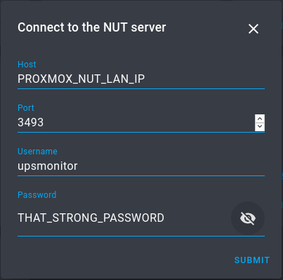
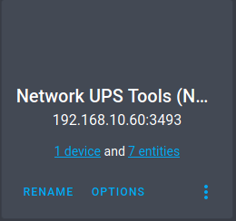
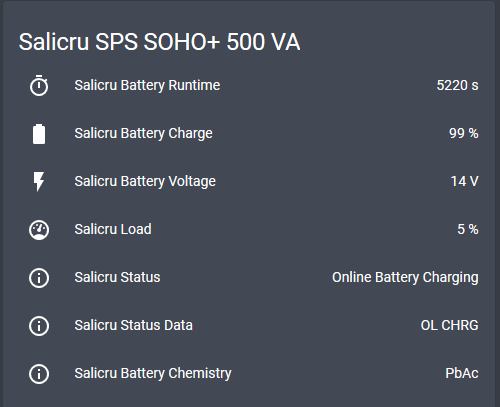

# Scope and objective

This procedure depicts all the steps made on an attempt to fully integrate these cheap UPS in Proxmox VE and Home Assistant Core running on it.

The model tested was a `Salicru SPS SOHO+ 500 VA`, as such:


# Requirements

* Proxmox VE 6.x
* Home Assistant Core 0.112.4
* USB port free on your hardware

# Proxmox VE integration

## Connecting the UPS to the Proxmox hardware

Use the UPS USB `Type B` port (**on the back!**) and the provided USB cable to connect it straight into another free USB port, after powering up the UPS on the front power button.

## Detecting the new USB device from the UPS

Run in the Proxmox shell, through its web GUI or SSH console:

```
# lsusb
```

You should see a similar line within the response:

```
Bus 001 Device 028: ID 06da:ffff Phoenixtec Power Co., Ltd 
```

If not, check the USB connection or use a different USB port on your hardware.


## Installing the NUT server and client

Run:

```
# apt update && apt install nut -y
```

## Configuring both NUT services

If does not exist, create the following file and its contents:

```
# nano /etc/nut/ups.conf
```

```
maxretry = 3
[salicru]
driver = usbhid-ups
port = auto
desc = "Salicru"
# 15 seconds between each polling
pollinterval = 15
```

Create the following rule that allows the `nut` user to access the UPS driver later on:

```
# nano /etc/udev/rules.d/90-nut-ups.rules
```

```
# Rule for a Salicru UPS
ACTION=="add", SUBSYSTEM=="usb", ATTR{idVendor}=="06da", ATTR{idProduct}=="ffff", MODE="0660", GROUP="nut"
```

Restart the udev to apply it:

```
# service udev restart
```

Next, replug the USB cable into the hardware USB port, waiting a couple of seconds between.


Then, paste the following contents inside:

```
# nano /etc/nut/nut.conf
```

```
MODE=standalone
```

Edit the file and adjust accordingly:

```
# nano /etc/nut/upsd.conf
```

```
# LISTEN <address> [<port>]
LISTEN 127.0.0.1 3493
# OR USE 0.0.0.0 IF NEEDED FOR ACCESSING ACROSS THE LAN
```

Set the monitor username (`upsmonitor`) and its password (`YOUR_STRONG_PASSWORD`). Use a strong one!

```
# nano /etc/nut/upsd.users
```

```
[upsmonitor]
password = YOUR_STRONG_PASSWORD
upsmon master

```

As the last file to edit:

```
# nano /etc/nut/upsmon.conf
```

```
# Commands for shutdown on power loss
MONITOR salicru@THE_PROXMOX_LAN_IP_OR_LOCALHOST 1 upsmonitor YOUR_STRONG_PASSWORD_HERE master
POWERDOWNFLAG /etc/killpower
SHUTDOWNCMD "/sbin/shutdown -h now"
```


Set permissions correctly:

```
# chown root:nut /etc/nut/*
```
and 
```
# chmod 640 /etc/nut/*
```

## Enabling and starting the NUT services

Set them as enabled, both server and client services:

```
# systemctl enable nut-server.service
```
and:
```
# systemctl enable nut-client.service
```

Finally, start both:

```
# service nut-server start
```
and 
```
# service nut-client start
```

If you are confronted with errors, check them through:

```
# journalctl -xe
```


# Home Assistant Core integration

## Configuring the NUT client integration

Go to your Home Assistant instance and open the following path:

```
Configuration -> Integrations -> + sign (at the buttom-right side) -> search for NUT
```

Fill the correct parameters:


>


After all the steps, you should find a proper configured integration like this:


>

## Setting up a lovelace card for all the entities

Finally, create a manual `lovelace` card with this proposal:

```
entities:
  - sensor.salicru_battery_runtime
  - sensor.salicru_battery_charge 
  - sensor.salicru_battery_voltage
  - sensor.salicru_load
  - sensor.salicru_status
  - sensor.salicru_status_data
  - sensor.salicru_battery_chemistry
type: entities
title: Salicru SPS SOHO+ 500 VA
```

Should be similar to this:




## Automate the shutdown process

In case of doubt, you can setup a safe guard, using Home Assistant, to monitor the UPS in discharge and trigger a Proxmox VE shutdown, on low battery level.

### Automations.yaml

```yaml
automation:
- id: 'upsdischarged'
  alias: 'UPS discharged - Start Shutdown'
  trigger:
    - platform: numeric_state
      entity_id: sensor.salicru_battery_charge
      below: 20
      for:
        seconds: 30
    - platform: numeric_state
      entity_id: sensor.salicru_battery_runtime
      below: 240
  condition:
    condition: and
    conditions:
    - condition: template
      value_template: >
        {{ not(is_state('sensor.salicru_status_data','OL CHRG')) }}
  action:
    - service: shell_command.proxmox_shutdown_host_pve
 ```
 
 ### Configuration.yaml
 
 ```yaml
 shell_command:
  proxmox_shutdown_host_pve: !secret proxmox_shutdown_host_pve
 ```
 
 ### Secrets.yaml
 
 ```yaml
 proxmox_shutdown_host_pve: bash /config/shell_scripts/proxmox_shutdown_host_pve.bash IP_PROXMOX USER_WITH_SYS.POWERMGMT PASSWORD NODE_NAME
 ```

### /config/shell_scripts/proxmox_shutdown_host_pve.bash

```bash
#!/bin/bash 

APINODE=$1
USER=$2
PASSWORD=$3
NODE=$4

curl --silent --insecure --data "username=${USER}@pve&password=${PASSWORD}" https://$APINODE:8006/api2/json/access/ticket | jq --raw-output '.data.ticket' | sed 's/^/PVEAuthCookie=/' > cookie
curl --silent --insecure --data "username=${USER}@pve&password=${PASSWORD}" https://$APINODE:8006/api2/json/access/ticket | jq --raw-output '.data.CSRFPreventionToken' | sed 's/^/CSRFPreventionToken:/' > csrftoken
curl --silent --insecure  --cookie "$(<cookie)" --header "$(<csrftoken)" -X POST https://$APINODE:8006/api2/extjs/nodes/$NODE/status --data 'command=shutdown'
rm cookie csrftoken
```

Reboot your Home Assistant instance.

Have fun! :-)

# References

* https://diyblindguy.com/howto-configure-ups-on-proxmox/
* https://blog.shadypixel.com/monitoring-a-ups-with-nut-on-debian-or-ubuntu-linux
* https://pve.proxmox.com/pve-docs/api-viewer/index.html#/nodes/{node}/status
